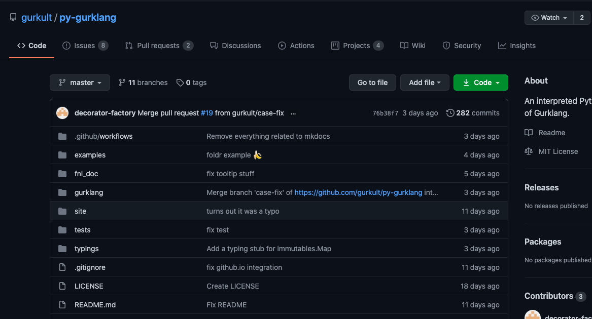

# meta
Questions and suggestions surrounding our open source cult.

<!--PLANS:START-->
- [ ] Title
- [ ] Description
- [ ] Info
- [ ] Projects
- [ ] Actions
- [ ] Images
- [ ] CODE OF CONDUCT and Guidelines(**TO BE DONE BY VESTER*)
- [ ] Why is OSS Amazing?
- [ ] Our Aim
- [ ] Links to Website, discord, etc.
<!--PLANS:END-->

## Our Projects:

<table>
  <tr>
    <!--TODO: Link the raw image from the default repo-->
    <td align="center"><a href="https://raw.githubusercontent.com/Vyvy-vi/meta/docs/readme-design/.github/images/reagurk.png"> <a href="https://github.com/gurkult/reagurk"><b>Reagurk</b></a> Our community website</a></td>
    <td align="center"><a href="https://raw.githubusercontent.com/Vyvy-vi/meta/docs/readme-design/.github/images/gurkbot.png"> <a href="https://github.com/gurkult/gurkbot"><b>Gurkbot</b></a> A discord bot for managing our discord server</a></td>   
  </tr>
  <tr>
    <td align="center"><a href="https://docs.gurkult.com/"> <a href="https://github.com/gurkult/py-gurklang"><b>Py-gurklang</b></a> Interpreted Python implementation of Gurklang</a></td>
    <td align="center"><a href="https://raw.githubusercontent.com/Vyvy-vi/meta/docs/readme-design/.github/images/gurkbot.png"> <a href="https://github.com/gurkult/gurkbot"><b>Gurkbot</b></a> A discord bot for managing our discord server</a></td>   
  </tr>
</table>

